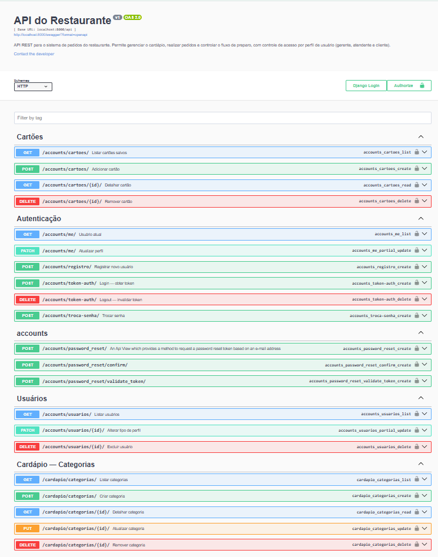
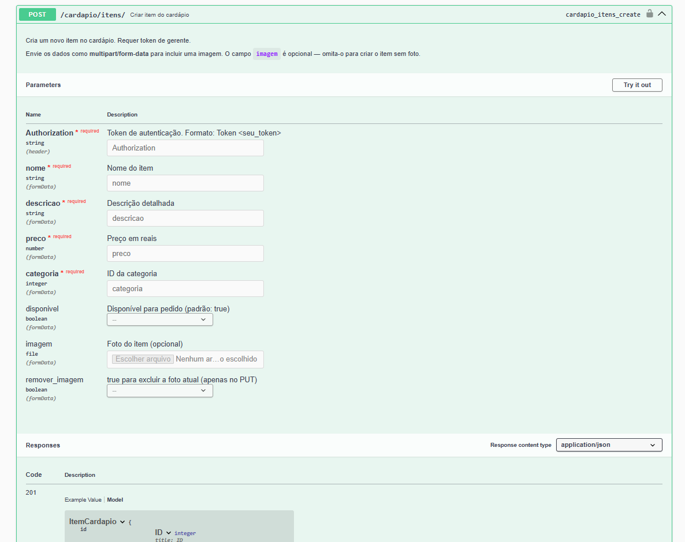
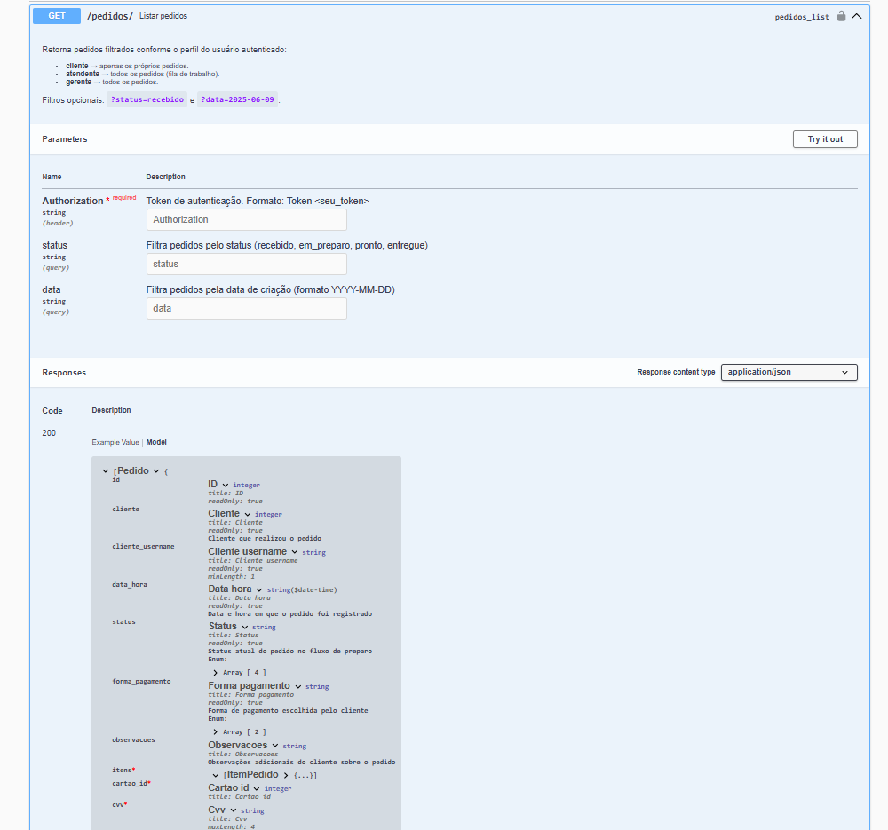

# Cucina Italiana — Backend (API REST)

API REST do sistema de pedidos do restaurante **Cucina Italiana**, desenvolvida como Trabalho 2 da disciplina de Programação para Web (INF1407) da PUC-Rio.

O sistema expõe endpoints para gerenciamento de cardápio, pedidos, usuários e autenticação, servindo como backend para o frontend separado. Toda a documentação dos endpoints está disponível interativamente via Swagger.

**Autora:**
- Gabriela Soares de Moraes

---

## Tecnologias Utilizadas

| Tecnologia | Uso |
|---|---|
| Python 3.x | Linguagem principal |
| Django | Framework web |
| Django REST Framework | Construção da API REST |
| django-cors-headers | Configuração de CORS (frontend em domínio diferente) |
| drf-yasg | Geração automática da documentação Swagger/OpenAPI |
| django-rest-passwordreset | Recuperação de senha por e-mail |
| rest_framework.authtoken | Autenticação por token |
| Pillow | Upload e processamento de imagens |
| python-dotenv | Leitura de variáveis de ambiente |
| SQLite | Banco de dados |

---

## Escopo da API

A API gerencia um sistema de restaurante com três perfis de usuário, cada um com acesso restrito às suas funcionalidades.

### Perfis de Usuário e Permissões

| Funcionalidade | Gerente | Atendente | Cliente |
|---|:---:|:---:|:---:|
| Ver cardápio (público) | ✅ | ✅ | ✅ |
| Criar/editar/excluir categorias | ✅ | — | — |
| Criar/editar/excluir itens do cardápio | ✅ | — | — |
| Ver todos os pedidos | ✅ | ✅ | — |
| Avançar status de pedidos | ✅ | ✅ | — |
| Excluir pedidos | ✅ | — | — |
| Criar pedido | — | — | ✅ |
| Ver os próprios pedidos | — | — | ✅ |
| Gerenciar cartões salvos | — | — | ✅ |
| Gerenciar usuários (alterar perfil) | ✅ | — | — |
| Excluir usuários | ✅ | — | — |

#### Gerente
Administra o cardápio (categorias e itens, incluindo upload de foto e controle de disponibilidade), visualiza todos os pedidos do restaurante, gerencia perfis de usuários e pode excluir pedidos e usuários.

#### Atendente
Visualiza a fila completa de pedidos e avança o status de cada um pelo fluxo: *Recebido → Em Preparo → Pronto → Entregue*.

#### Cliente
Consulta o cardápio público, cria pedidos (com cartão salvo e validação de CVV), acompanha seus próprios pedidos e gerencia seus cartões salvos.

---

## Endpoints Principais

A documentação completa e interativa está disponível em `/swagger/` e `/redoc/` após iniciar o servidor.

### Autenticação — `/api/accounts/`

| Método | Caminho | Auth | Descrição |
|---|---|---|---|
| POST | `/registro/` | não | Registrar novo usuário (tipo: cliente) |
| POST | `/token-auth/` | não | Login — retorna token |
| DELETE | `/token-auth/` | Token | Logout — invalida o token |
| GET | `/me/` | Token | Dados do usuário autenticado |
| PATCH | `/me/` | Token | Atualizar dados pessoais |
| POST | `/troca-senha/` | Token | Trocar senha |
| POST | `/password_reset/` | não | Solicitar recuperação de senha por e-mail |
| POST | `/password_reset/confirm/` | não | Confirmar nova senha com token do e-mail |
| GET/POST | `/cartoes/` | Token cliente | Listar / adicionar cartões salvos |
| GET/DELETE | `/cartoes/<id>/` | Token cliente | Detalhar / remover cartão |
| GET | `/usuarios/` | Token gerente | Listar todos os usuários |
| PATCH | `/usuarios/<id>/` | Token gerente | Alterar tipo de perfil |
| DELETE | `/usuarios/<id>/` | Token gerente | Excluir usuário |

### Cardápio — `/api/cardapio/`

| Método | Caminho | Auth | Descrição |
|---|---|---|---|
| GET | `/categorias/` | não | Listar categorias (público) |
| POST | `/categorias/` | Token gerente | Criar categoria |
| GET/PUT/DELETE | `/categorias/<id>/` | misto | Detalhar / editar / excluir |
| GET | `/itens/` | não | Listar itens (público; aceita `?categoria=<id>`) |
| POST | `/itens/` | Token gerente | Criar item |
| GET/PUT/DELETE | `/itens/<id>/` | misto | Detalhar / editar / excluir |

### Pedidos — `/api/pedidos/`

| Método | Caminho | Auth | Descrição |
|---|---|---|---|
| GET | `/` | Token | Listar pedidos (filtrado por perfil) |
| POST | `/` | Token cliente | Criar pedido |
| GET | `/<id>/` | Token | Detalhar pedido |
| PATCH | `/<id>/` | Token atendente/gerente | Avançar status |
| DELETE | `/<id>/` | Token gerente | Excluir pedido |

---

## Imagens

**Visão geral da documentação Swagger — todos os grupos de endpoints da API:**



**Endpoint `POST /api/cardapio/itens/` expandido — parâmetros de formulário para criação de item com upload de imagem:**



**Endpoint `GET /api/pedidos/` expandido — filtros disponíveis e exemplo de resposta:**



---

## Como Rodar Localmente

### Pré-requisitos
- Python 3.10 ou superior
- Git

### Passo a Passo

**1. Clonar o repositório**
```bash
git clone https://github.com/gabisoaresm/restaurante-backend.git
cd restaurante-backend
```

**2. Criar e ativar o ambiente virtual**
```bash
# Criar
python -m venv venv

# Ativar (Windows)
venv\Scripts\activate

# Ativar (Linux/macOS)
source venv/bin/activate
```

**3. Instalar as dependências**
```bash
pip install -r requirements.txt
```

**4. Configurar o arquivo `.env`**

Copie o arquivo de exemplo e preencha com suas configurações:
```bash
cp .env.example .env
```

Campos do `.env`:
```env
SECRET_KEY=sua-chave-secreta-aqui
DEBUG=True

# CORS — domínios do frontend permitidos (separados por vírgula)
CORS_ALLOWED_ORIGINS=http://localhost:8080,http://127.0.0.1:8080

# E-mail — modo console (imprime no terminal, sem envio real):
EMAIL_BACKEND_TIPO=console

# E-mail — modo Gmail (substitua pelas suas credenciais):
# EMAIL_BACKEND_TIPO=gmail
# EMAIL_HOST_USER=seu-email@gmail.com
# EMAIL_HOST_PASSWORD=sua-senha-de-app-gmail
```

**5. Rodar as migrations**
```bash
python manage.py migrate
```

**6. Criar superusuário (para acessar o Django Admin)**
```bash
python manage.py createsuperuser
```

> O superusuário permite criar o primeiro usuário **Gerente** via painel em `/admin/`.

**7. Iniciar o servidor**
```bash
python manage.py runserver
```

Acesse a documentação Swagger em: [http://127.0.0.1:8000/swagger/](http://127.0.0.1:8000/swagger/)

---

### Criando o Primeiro Gerente

O endpoint público `/api/accounts/registro/` cria sempre um perfil de **Cliente**. Para criar um Gerente:

**Via Django Admin:**
1. Acesse /admin/ com o superusuário
2. Crie um usuário em *Users*
3. Em *Perfils*, altere o tipo para `gerente`

**Via frontend (se já houver um Gerente no sistema):**
1. Faça login como Gerente no frontend
2. Acesse **Gerenciar Usuários**
3. Altere o perfil do usuário desejado

---

### Usuários de Demonstração

| Perfil | Username | Senha |
|---|---|---|
| Gerente | usergerente | senhager123 |
| Atendente | useratendente | senhaaten123 |
| Cliente | usercliente | senhacli123 |

---

## O Que Funciona

### Autenticação e Perfis
- [x] Registro de novos usuários (sempre cria perfil *Cliente*)
- [x] Login com geração de token de autenticação
- [x] Logout com invalidação do token
- [x] Endpoint `/me/` retorna dados do usuário autenticado, incluindo tipo de perfil
- [x] Atualização de dados pessoais (`first_name`, `last_name`, `email`)
- [x] Troca de senha com renovação automática do token
- [x] Recuperação de senha por e-mail (console em dev, Gmail em produção)
- [x] Controle de acesso por perfil em todos os endpoints protegidos

### CRUD — Categorias (Gerente)
- [x] Criar categoria
- [x] Listar categorias (público, sem autenticação)
- [x] Editar categoria
- [x] Excluir categoria

### CRUD — Itens do Cardápio (Gerente)
- [x] Criar item (com upload de foto via `multipart/form-data`)
- [x] Listar itens (público; aceita filtro `?categoria=<id>`)
- [x] Editar item (incluindo substituição de foto e controle de disponibilidade)
- [x] Excluir item

### Pedidos
- [x] Criar pedido com lista de itens, cartão salvo e validação de CVV (cliente)
- [x] Listar pedidos — cliente vê apenas os próprios; atendente/gerente veem todos
- [x] Detalhar pedido (com validação de acesso por perfil)
- [x] Avançar status do pedido (atendente/gerente): `recebido → em_preparo → pronto → entregue`
- [x] Filtrar pedidos por status (`?status=recebido`) e por data (`?data=2025-06-09`)
- [x] Excluir pedido (gerente)

### Cartões Salvos (Cliente)
- [x] Adicionar cartão (armazena apenas os 4 últimos dígitos; CVV não é retornado nas respostas)
- [x] Listar cartões do cliente autenticado
- [x] Detalhar cartão
- [x] Excluir cartão

### Gerenciamento de Usuários (Gerente)
- [x] Listar todos os usuários cadastrados
- [x] Alterar tipo de perfil de qualquer usuário
- [x] Excluir usuário (com proteção para não excluir a si mesmo)

### Documentação
- [x] Swagger UI disponível em `/swagger/`
- [x] ReDoc disponível em `/redoc/`
- [x] Todos os endpoints documentados com descrição, parâmetros e exemplos de resposta

---

## O Que Não Funciona / Limitações Conhecidas

| Limitação | Descrição |
|---|---|
| **Pagamento simulado** | Não há integração com gateway de pagamento real. O sistema valida apenas o CVV contra o valor salvo. |
| **CVV armazenado** | Para viabilizar a validação no pagamento simulado, o CVV é armazenado no banco. Em produção real, isso não seria feito. |
| **Criação do primeiro gerente** | O cadastro público cria sempre um perfil de cliente — decisão intencional de segurança. O primeiro gerente deve ser criado via Django Admin. |
| **Exclusão em cascata** | Excluir uma categoria remove permanentemente todos os itens vinculados a ela. |
| **Upload de imagem sem CDN** | As imagens são servidas diretamente pelo Django via `/media/`. Em produção de alta escala, o ideal seria usar um serviço como Amazon S3. |

---

## Link do Site Publicado

[https://cucinaitaliana.pythonanywhere.com/swagger/](https://cucinaitaliana.pythonanywhere.com/swagger/)
